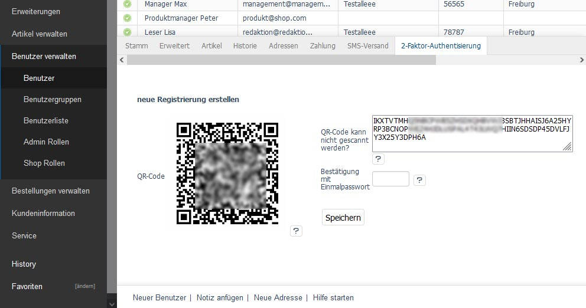
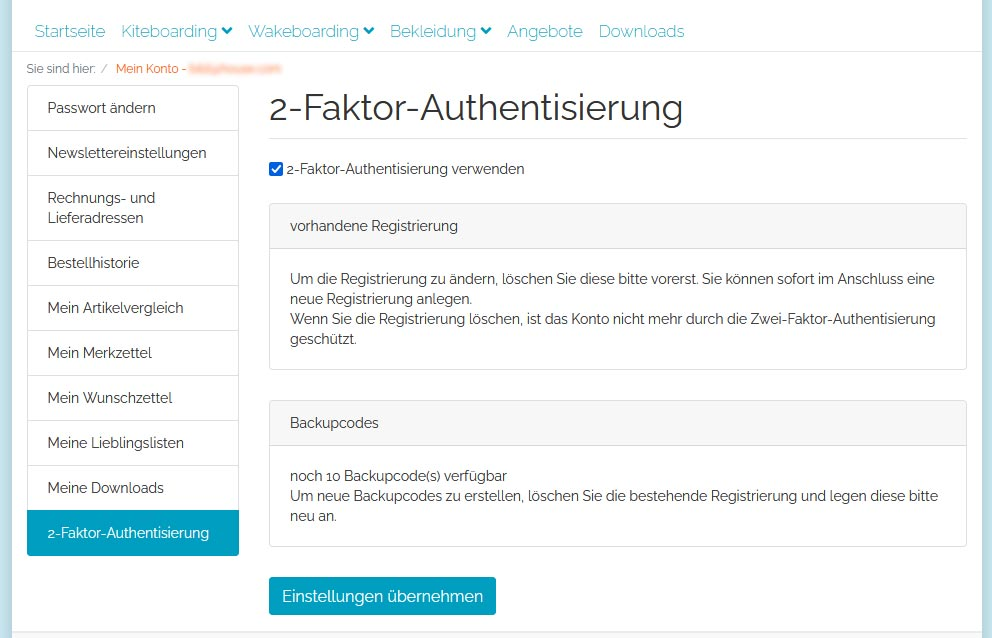
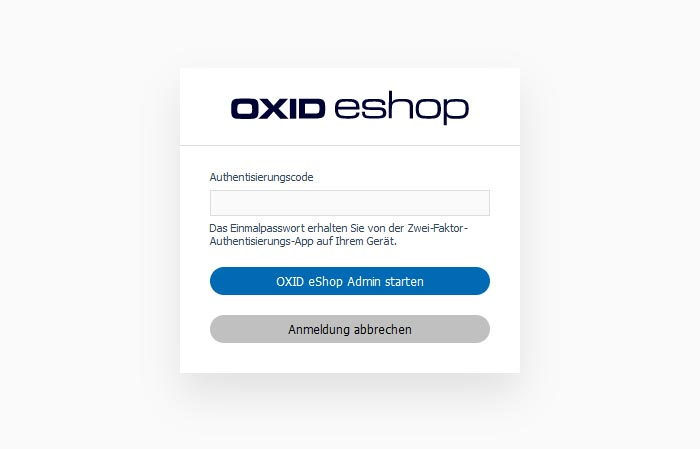
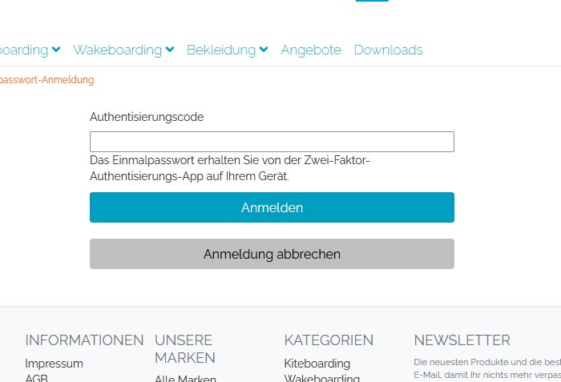

[](README.md)
[](README.en.md)

# 2-factor authentication (TOTP) for OXID eShop

This module provides a 2-factor authentication (time-dependent one-time password) for login in front- and backend in addition to user name and password.

## Features

- 2-factor authentication for logins in front- and backend in addition to username and password
- Activation and setup possible in the front and back end
- Authentication is shown for user accounts that have this enabled - otherwise the usual default login.
- Access can be set up in the Auth app by scannable QR code or copyable character string
- Validation of one-time passwords and generation of QR codes are only carried out within the shop - no communication to the outside necessary
- static backup codes also allow (limited) login without access to the generation tool
- The setting up of the second factor can be made obligatory for admin users.

### Setup



### Login



## System requirements

This package requires an OXID eShop installed with Composer in one of the following versions:

- 6.3.x
- 6.4.x
- 6.5.x

and its requirements.

## Getting Started

```
composer require d3/oxtotp
```

Activate the module in the admin area of the shop in "Extensions -> Modules".

The necessary configuration can be found in the same area in the "Settings" tab.

## Changelog

See [CHANGELOG](CHANGELOG.md) for further informations.

## Contributing

If you have a suggestion that would make this better, please fork the repo and create a pull request. You can also simply open an issue. Don't forget to give the project a star! Thanks again!

- Fork the Project
- Create your Feature Branch (git checkout -b feature/AmazingFeature)
- Commit your Changes (git commit -m 'Add some AmazingFeature')
- Push to the Branch (git push origin feature/AmazingFeature)
- Open a Pull Request

## Support

If you have any questions about the *messaging service* and its *contracts*, please contact the [LINK Mobility Team](https://www.linkmobility.de/kontakt).

For *technical inquiries* you will find the contact options in the [composer.json](composer.json).

## License
(status: 2018-10-17)

Distributed under the GPLv3 license.

```
Copyright (c) D3 Data Development (Inh. Thomas Dartsch)

This software is distributed under the GNU GENERAL PUBLIC LICENSE version 3.
```

For full copyright and licensing information, please see the [LICENSE](LICENSE.md) file distributed with this source code.

## Credits

Contributors to this module were:

- Tobias Matthaiou

Thanks to.