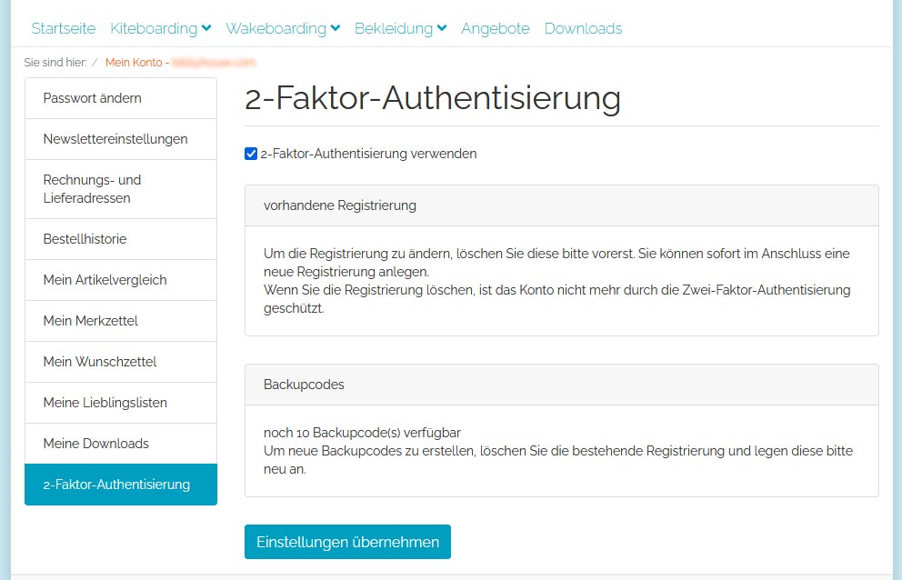

[](README.md)
[](README.en.md)

# 2-Faktor-Authentisierung (TOTP) für OXID eShop

Dieses Modul stellt eine 2-Faktor-Authentisierung (zeitabhängiges Einmalpasswort) zum Login in Front- und Backend zusätzlich zu Benutzername und Passwort zur Verfügung.

## Features

- 2-Faktor-Authentisierung für Logins in Front- und Backend zusätzlich zu Benutzername und Passwort
- Aktivierung und Einrichtung im Front- und Backend möglich
- Authentisierung wird bei Benutzerkonten gezeigt, die dieses aktiviert haben - sonst die übliche Standardanmeldung
- Einrichtung des Zugangs in der Auth-App kann durch scanbaren QR-Code oder kopierbare Zeichenkette erfolgen
- Validierung der Einmalpassworte und Generierung der QR-Codes werden ausschließlich innerhalb des Shops durchgeführt - keine Kommunikation nach außen nötig
- statische Backupcodes ermöglichen auch eine (begrenzte) Anmeldung ohne Zugang zum Generierungstool
- für Adminbenutzer kann die Einrichtung des zweiten Faktors verpflichtend eingestellt werden

### Einrichtung



### Login


## Systemanforderungen

Dieses Paket erfordert einen mit Composer installierten OXID eShop in einer der folgenden Versionen:

- 6.3.x
- 6.4.x
- 6.5.x

und dessen Anforderungen.

## Erste Schritte

```
composer require d3/oxtotp
```

Aktivieren Sie das Modul im Shopadmin unter "Erweiterungen -> Module".

Die nötige Konfiguration finden Sie im selben Bereich im Tab "Einstell.".

## Changelog

Siehe [CHANGELOG](CHANGELOG.md) für weitere Informationen.

## Beitragen

Wenn Sie eine Verbesserungsvorschlag haben, legen Sie einen Fork des Respoitories an und erstellen Sie einen Pull Request. Alternativ können Sie einfach ein Issue erstellen. Fügen Sie das Projekt zu Ihren Favoriten hinzu. Vielen Dank.

- Erstellen Sie einen Fork des Projekts
- Erstellen Sie einen Feature Branch (git checkout -b feature/AmazingFeature)
- Fügen Sie Ihre Änderungen hinzu (git commit -m 'Add some AmazingFeature')
- Übertragen Sie den Branch (git push origin feature/AmazingFeature)
- Öffnen Sie einen Pull Request

## Lizenz
(Stand: 17.10.2018)

Vertrieben unter der GPLv3 Lizenz.

```
Copyright (c) D3 Data Development (Inh. Thomas Dartsch)

Diese Software wird unter der GNU GENERAL PUBLIC LICENSE Version 3 vertrieben.
```

Die vollständigen Copyright- und Lizenzinformationen entnehmen Sie bitte der [LICENSE](LICENSE.md)-Datei, die mit diesem Quellcode verteilt wurde.

## Credits

Zu diesem Modul haben beigetragen:

- Tobias Matthaiou

Vielen Dank.